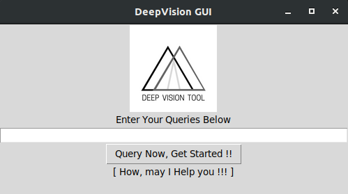

# DeepVision Tool

The main aim of this repository is to provide Deep Learning as a service via various architectures like
Desktop base application or Client-Server based web-application.

To know more, refer to [Fun Introduction](assets/FunIntroduction.pdf) for this project.

## Tkinter Based GUI tool

It contains a operational GUI which executes python scripts along within same console to run them.  
With an equivalent functionality of a flow based chatbot which launches the modules and help FAQs.  

## GUI Screenshot

  

## GUI Working Screenshot

  

Test files are being runned and tested in this repository. By simply changing the path in code, DeepVision Modules can be executed from GUI itself.  

```
Simply change this path, add location of execution file of module

subprocess.call('python3 test_scripts/script_zero.py', shell=True)
```

The following command is used to run the GUI. Dependencies involves any python 3.5.x+ version with module like `tkinter`, `subprocess` being present for GUI execution.  

```
python3 mainGUI.py
```

Modularity and Independence are main focus of this project.  
Refer [Project Website](http://deepvisioncentre.github.io/) for more information related to each module or submitting test images.  

#### Functionalities of GUI

* Flow-based chatbot for opening sub-modules.
* Help-FAQs added.
* Project Logo added.
* Multiple modules can be opened in parallel.
* Passes all the test and assumptions.

---

Read [contribution guide](Contributing.md) before contributing to these collection of repositories.  
